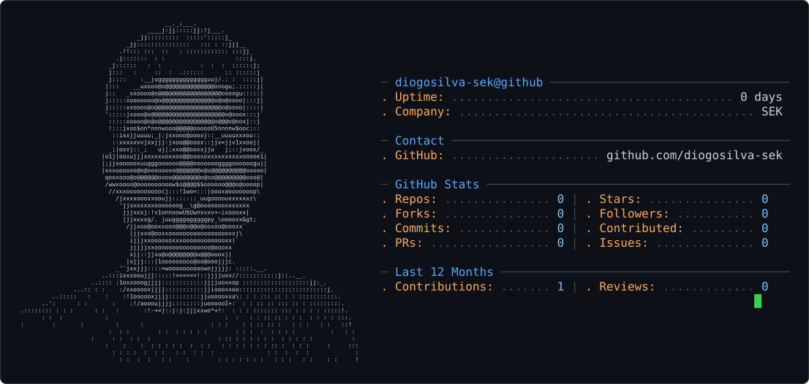

<picture>
  <source media="(prefers-color-scheme: dark)" srcset="dark_mode.svg" />
  <source media="(prefers-color-scheme: light)" srcset="light_mode.svg" />
  
</picture>

## Diogo Henrique

Engenheiro de software fullstack.

Antes disso, atuei como analista de sistemas com Oracle PL/SQL e Forms, e trabalhei com Postgres, AWS e GCP. Formado em Ciencia da Computacao pelo IFSULDEMINAS.

### Certificações

### Stack atual

  
  
  
  
  

### Experiencia anterior

  
  
  
  
  

